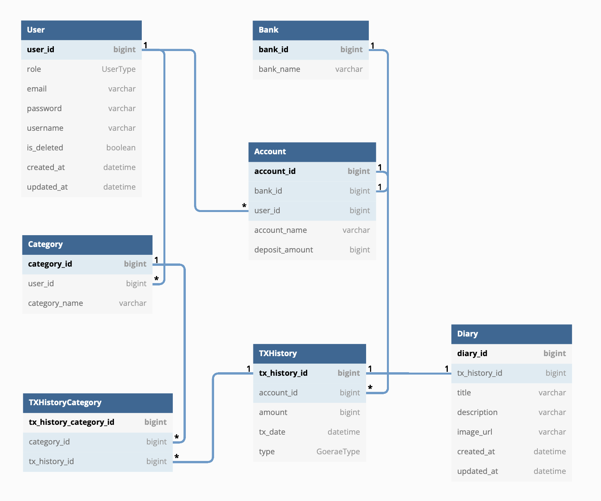

# 📒 Gubun - 가계부

## 🖥 사용자 인터페이스(UI)

- 추가 예정

## ⚙️ 개발 환경(Development Environment)

| 분류 | 개발환경 | 
|---|---|
| 운영체제 | Windows 10 64bit / Mac OS |
| 개발도구 | Intellij IDEA, Gradle |
| 프레임워크 | Spring Boot 2.7.0 |
| 데이터베이스 | PostgreSQL (Release 13.7) |
| 버전 관리 | Github, Git |
| 배포 및 운영 | AWS EC2, AWS RDS, AWS S3, Docker, Github Actions  |
| 오픈소스 및 외부 라이브러리 |  |

## 🛠 세부 기술 스택(Tech Stack)

### 백엔드(Back-end)

- **Spring Boot 2.7.0**
	- Spring Web MVC
	- Spring Data JPA
	- Spring Security

### 데이터베이스(Database)

- **PostgreSQL (Release 13.7)**

### 프론트엔드(Front-end)

- **Thymeleaf**
- **Bootstrap**

### ETC

- 추가 예정

## 📝 도메인 모델 분석(Domain Model Analysis)

### 회원(User)

- 회원과 계좌의 관계 : 회원은 여러 개의 계좌를 소유할 수 있다.(1:N)
- 회원과 카테고리의 관계 : 회원은 여러 개의 카테고리를 보유할 수 있다.(1:N)

### 계좌(Account)

- 계좌와 회원의 관계 : 회원은 여러 개의 계좌를 소유할 수 있다.(N:1)
- 계좌와 거래의 관계 : 한 개의 계좌에서 여러번의 거래가 발생할 수 있다.(1:N)

### 카테고리(Category)

- 카테고리와 회원의 관계 : 회원은 여러 개의 카테고리를 보유할 수 있다.(N:1)
- 카테고리와 거래의 관계 : 한 개의 카테고리는 여러 개의 거래에서 생길 수 있다. 또한 한 개의 거래는 여러 개의 카테고리가 존재할 수 있다. (N:N)

### 거래

- 거래와 계좌의 관계 : 한 개의 계좌에서 여러번의 거래가 발생할 수 있다.(N:1)
- 거래와 카테고리의 관계 : 한 개의 카테고리는 여러 개의 거래에서 생길 수 있다. 또한 한 개의 거래는 여러 개의 카테고리가 존재할 수 있다. (N:N)
- 거래와 일기의 관계 : 한 개의 거래에서는 한 번의 일기를 작성할 수 있다.(1:1)

### 일기

- 일기와 거래의 관계 : 한 개의 거래에서는 한 번의 일기를 작성할 수 있다.(1:1)

## 📝 테이블 정의서(Entity Details)

- [바로가기](./table_details.md)

## 🔗 엔티티-관계 모델(Entity Relationship Diagram)

## 📐 트러블 슈팅(Trouble Shooting)

- 추가 예정